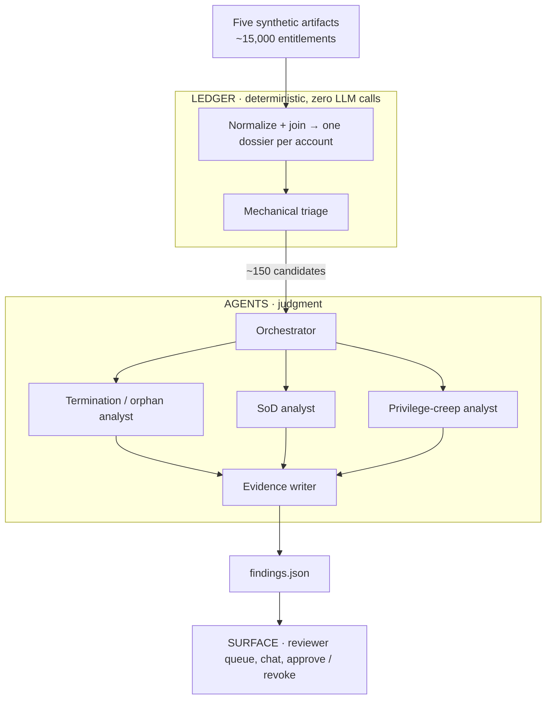

# Meridian UAR — Claude Certified Architect Capstone Program

**Status:** draft for review · 15 July 2026

Ten weeks. Four of coursework, six building an agentic access-review system against a fictional
company's messy data — then graded on a quarter it has never seen.

| | |
|---|---|
| Program length | 10 weeks |
| Weekly load | 6 hours |
| Target exam | Claude Certified Architect — Foundations (CCAR-F) |
| Exam format | 60 questions, 120 minutes, $125, passing 720/1000, no prerequisites |
| Audience | IT / compliance practitioners — deep domain knowledge, light engineering |
| Cohort model | Individual work, weekly synchronous call |

The certification is hosted on Anthropic's partners portal, not the public catalog.

---

## Phase one — coursework, weeks 1–4

Anthropic does not publish course durations in a readable place. The figures below were read from
the course platform's own first-party configuration.

| Course | Lectures | Video | Why it's here |
|---|---:|---:|---|
| Building with the Claude API | 84 | 8.1 hrs | The spine. 10 quizzes, hands-on Python. |
| Claude Code in Action | 15 | 1.0 hr | Added — maps to the 20% Claude Code domain. |
| AI Fluency: Framework & Foundations | 14 | 1.1 hrs | Added — on Anthropic's own CCAR-F list. |
| Claude Code 101 | 12 | 1.5 hrs | Install, agentic loop, CLAUDE.md. |
| Introduction to MCP | 16 | 1.0 hr | Tool design domain, 18% of the exam. |
| Introduction to agent skills | 6 | text | Not on Anthropic's list; serves the capstone directly. |
| Introduction to subagents | 4 | text | Not on Anthropic's list; serves the capstone directly. |
| GitHub & VS Code intro | — | ~3 hrs | Sourced separately. This cohort needs it. |

**Video runtime is a floor, not a total.** The Cowork course advertises 0.5 hours of video, but
Anthropic's own per-lesson estimates sum to exactly 121 minutes — a 4× gap. Applying that
calibration, the API course alone is realistically 12–16 hours of seat time.

**Total Phase 1: ~20–25 hours → four weeks at six hours.** The API course spans weeks 1–3.

Anthropic publishes no prep path for CCAR-F; it maps the exam to standalone courses. Agent Skills
and subagents are not on that list but are retained because they serve the capstone directly.

---

## What the exam weights

| CCAR-F domain | Weight | Where it lands |
|---|---:|---|
| Agentic Architecture & Orchestration | 27% | Module 3 — orchestrator and specialists |
| Claude Code Configuration & Workflows | 20% | Module 2 — policies as Skills |
| Prompt Engineering & Structured Output | 20% | Module 2 + the findings contract; efficiency (caching, batching) in Module 5 |
| Tool Design & MCP Integration | 18% | Module 3 — agents call Meridian over MCP |
| Context Management & Reliability | 15% | Module 1 + Module 5 |

---

## The case study — Meridian Regional Energy

A regional gas and electric utility. Roughly 1,200 employees, 22 business applications, ~15,000
entitlements, a two-person IAM team, and a Q3 access review that is three weeks late. Mid-size,
unglamorous, instantly recognizable to anyone who has done this work.

The industry is chosen deliberately. A utility has a real ERP, a large field workforce, heavy
contractor use, and a small IT shop — without dragging in PHI or cardholder scope. That keeps the
compliance pressure internal, which is the framing this program picked. See the
[generator spec](./2026-07-15-data-generator-design.md) for the full world: departments, app
catalog, SoD matrix, and personas.

### What ships in the kit

| Artifact | Shaped like | Carries |
|---|---|---|
| HR roster | Workday export | Employee ID, dept, manager, title, hire/term dates, FTE vs. contractor |
| IAM entitlements | Okta / AD export | Account, app, role, granted date, granted by, last login |
| Ticketing | ServiceNow export | Access requests and their approvals — or their conspicuous absence |
| Policy corpus | Five PDFs | Access Control, SoD matrix, Privileged Access, Contractor Access, Termination |
| Last quarter's review | Prior campaign results | What was already approved, and by whom |

Meridian's policy corpus is written the way real policies are — prose, some genuinely ambiguous,
mildly self-contradictory. Learners will hit this in Module 2 and think it is a bug in the case
study. It is the most authentic thing in it.

All artifacts are produced by a **seeded generator**, not hand-authored. This is what makes the
grading model below possible, and it means a new seed yields a new exam for every future cohort.

---

## The planted findings

Because we author the data, the answer key exists by construction. But an access-review answer key
is honestly tiered.

### Must catch — deterministic, binary score

- Terminated employee still holding admin
- Account with no HR record at all
- Privileged grant with no approval ticket
- Grant dated before the holder's hire date
- Dormant privileged account — no login in 180 days

*Scored → catch rate.*

### Judgment — no single right verdict

- Contractor past end date whose manager vouched in a ticket
- A transfer who kept their old department's access — privilege creep
- SoD conflict with a documented compensating control

*Scored → quality of reasoning, not the verdict.*

### Must not flag — traps

- Service account sitting in the approved registry
- Break-glass account that is dormant *by design*
- Employee on leave — not terminated
- An SoD pair the policy explicitly exempts for that department

*Scored → false-positive rate.*

The traps are the class worth defending hardest. Any system can flag everything. The reason human
reviewers rubber-stamp real access-review campaigns is that the tool cried wolf — teaching that
false positives cost more than another catch-rate point is worth more than the point.

---

## Architecture

> **Reconciliation is code. Judgment is agents.**

Nobody should ask a model to join a 1,200-row roster against a 15,000-row entitlement export. That
is a database operation — slow, expensive, and wrong in ways you cannot test. But *"is this
contractor's manager vouching for them enough, given the standard says access ends at contract
end?"* is irreducibly judgment, and no rules engine reaches it.

Practitioners reflexively reach for the model to do everything and end up with a system that is
both costly and untrustworthy. Learning where that line sits *is* the architect skill — so the
architecture makes the line structural. Three layers, each independently testable.



### The Ledger — no models

Ingests the five artifacts, normalizes them, joins them into one dossier per account: who holds it,
what HR says, what tickets exist, when it was last used, what last quarter decided. Then triages —
"no HR record" and "term date in the past" are just code. Fifteen thousand entitlements become
roughly a hundred and fifty candidates. Everything else is provably clean.

Roughly half the dataset is boring by construction: six apps (AD, Gateway, Slack, Zoom, VPN, badge
access) are held by nearly everyone. That is what the Ledger exists to triage away.

That narrowing is the module's real lesson: **context economics.** They will feel it in the API
bill if they get it wrong.

### The Agents — judgment only

An orchestrator triages candidate dossiers and fans out to specialists: a termination/orphan
analyst, an SoD analyst, a privilege-creep analyst, and an evidence writer. Each loads only the
policy Skills it needs and sees only the dossiers it needs — context isolation with a business
reason rather than a textbook one. The evidence writer turns findings into something a human
reviewer will actually read.

### The Surface — human decides

A reviewer works the queue, asks "why is this flagged?", approves or revokes. The agents did the
work; the human owns the decision. That is the correct shape for compliance, where a person signs
the attestation.

### The contract — fixed in Module 0, never changed

```
run_review(export_dir: Path, limit: int | None = None) -> findings.json
```

Each finding carries: `scope` (account or application), account, employee (nullable — orphans have
none), app, entitlement, category, severity, recommendation (revoke / review / retain), rationale,
evidence with source references, policy citations, and confidence.

Most findings are account-scoped — a person holding an entitlement they shouldn't. A few are
application-scoped: the prior-review coverage gap (see the generator spec) is a finding about an
*app*, not an account, so `scope` tells the reviewer and the grader which they're looking at.
Account-only fields are null on an application-scoped finding.

**On `limit`.** It caps how many candidates reach the agent layer, and exists for the debugging
loop. A full run is ~150 candidates fanned across two or three specialists each — several hundred
model calls. A learner tuning an analyst's prompt does not need 150 candidates to know whether it
helped; twenty tells them. Without an obvious cheap path, they will re-run the whole pipeline
thirty times in an afternoon, and that is the most likely way this program blows its budget.

Grading always calls with `limit=None`, so it never touches scoring. It earns its place in the
graded signature for three reasons: the kit can teach cheap iteration from Module 0, submissions
stay uniform, and the grading agent can smoke-test with `limit=5` to confirm a submission runs at
all before committing to a full scored run.

Learners could slice their own candidate lists without this — everything downstream of
`export_dir` is their code. The parameter is a nudge and a grading convenience, not a capability
they otherwise lack.

This one interface earns its keep four times: the grading agent calls it on unseen Q4 data, their
eval harness calls it against the labeled Q3 key, the UI renders it, and a structured-output schema
with a real downstream consumer *is* the 20% exam domain. They learn why schemas matter by having
something break when they drift.

The kit's MCP server exposes Meridian's systems as MCP tools, so every learner gets client-side MCP
experience without building server plumbing.

---

## The six modules — weeks 5–10

Every week ships the same three things: **code in the repo, a decision log, and the artifacts the
system produced.**

### Module 0 — Setup kit *(runs during Phase 1)*

Devcontainer, repo, keys wired, Meridian data loaded, MCP server running, the contract fixed, and a
smoke test that proves it all works. Nobody loses Week 5 to a Python install. **You build this.**

### Module 1 — The Ledger · *Context Management, 15%*

Ingest, normalize, join, triage — pure Python, no models. Ends with one deliberately small agent
reviewing a *single* account end-to-end, so Friday of week one has a win. That early win matters
more for this audience than architectural purity.

### Module 2 — Policy as Skills · *Prompt Engineering 20% + Claude Code Config 20%*

Meridian's prose policies become Agent Skills. Ships a skill pack plus an agent that answers "does
this violate policy, and cite the clause."

### Module 3 — Subagent decomposition · *Orchestration 27% + Tool/MCP 18%*

Orchestrator plus specialists, fanned across the candidate set, calling Meridian over MCP. Ships a
complete `findings.json` for Q3. The heaviest week, mapped to the heaviest domain.

### Module 4 — The Surface

Reviewer queue, "why is this flagged?" chat, approve/revoke, evidence trail. The week it becomes
demoable to someone who doesn't code — which is what makes it a proof of concept rather than a
script.

### Module 5 — Evals · *Reliability, 15% + a slice of Prompt Engineering, 20%*

Learners never hold the answer key — only the grading agent does, and only against a Q4 quarter
they haven't seen (see the [Module 0 spec](./2026-07-22-module0-setup-kit-design.md)'s kit
boundary). So Module 5 doesn't teach "score against the key" as originally sketched; it teaches
building confidence in a system without ever seeing the number it's truly graded on, on two axes —
**effectiveness** (schema/coverage checks, self-consistency, a learner-authored hand-labeled
micro-key, an LLM-as-judge rationale rubric) and **efficiency** (cost per review, latency, prompt
caching, and the Message Batches API against Module 3's several-hundred-call fan-out). Full design,
including why efficiency now shares this module with effectiveness: the
[Module 5 evals spec](./2026-07-28-module5-evals-design.md).

### Module 6 — Generalization & submission

They regenerate Meridian with their own seed and run their system against a quarter they have never
seen — the grading procedure, rehearsed a week early. Anyone who hard-coded to the Q3 key finds out
now instead of at grading, and finding out is the lesson. Then hardening, final decision log,
submission.

### One tension, named so it can be overruled

Evals land at Module 5, after everything is built. A purist would demand eval-first. A five-case
smoke eval ships in the kit and grows weekly, so measurement is never absent — but the formal
harness comes late, and that is a real compromise. Building an eval harness before you have anything
to evaluate is deeply abstract, and this audience will bounce off it. Better they feel the pain in
Module 5 and understand *why* eval-first exists than perform the ritual in Week 5 without it landing.

---

## Grading

They submit a repo. A Claude Code agent clones it, reads the architecture, runs their eval harness,
and calls `run_review()` against a **freshly generated Q4 quarter they have never seen** — new
employees, new entitlements, new planted findings. It scores catch rate on the must-catch class,
false-positive rate against the traps, and reads the judgment-tier rationales for soundness. It
writes a findings report.

**You make the call.** The agent is the expert reviewer; you are the judge.

Withholding *data* rather than *labels* is what makes this defensible. Had we shipped one dataset
with 40% of labels hidden, every record would still be sitting there to be eyeballed and
special-cased — and a hard-coded system would be indistinguishable from a working one. The generator
costs more up front and buys a new exam for every future cohort from a new seed.

---

## The weekly call

A rhythm falls out of the module structure: first half on what broke this week — peer debugging —
and second half on the module's architectural decision, the one every learner had to make and made
differently.

Week three's is the richest. *How did you split your subagents, and why?* There is no single right
answer, and hearing six versions of it is the best exam preparation in the program.

---

## Decisions taken

| Question | Call |
|---|---|
| Audience | IT / compliance practitioners — deep domain, light engineering |
| Compliance domain | Internal IT policy & audit |
| Capstone scenario | Quarterly user access review (UAR) |
| Stack | Prescribed: Python + Claude Agent SDK + a simple web UI |
| Scaffolding | Case study + data + a Module 0 setup kit |
| Must demonstrate | Subagent decomposition, Agent Skills, evals |
| MCP | Kit ships a server they consume; building one is the stretch goal |
| Answer key | Full labeled Q3; grading runs an unseen generated Q4 |
| Weekly deliverable | Code + decision log + the artifacts their system produced |
| Claude access | Claude Code seats + API keys with billing |
| Grading | Agent scores against a rubric and the hidden quarter; human assigns the grade |

## Open questions

1. **Cohort size** — drives grading load and whether the weekly call can hold demos.
2. **API spend ownership and per-learner limits** — a runaway fan-out in Module 3 is the obvious
   failure mode.
3. **Fidelity bar for the case study** — does it need to survive contact with a real auditor's eye,
   or is plausible enough?
4. **Eval timing** — is the Module 5 compromise acceptable, or should measurement move earlier?
